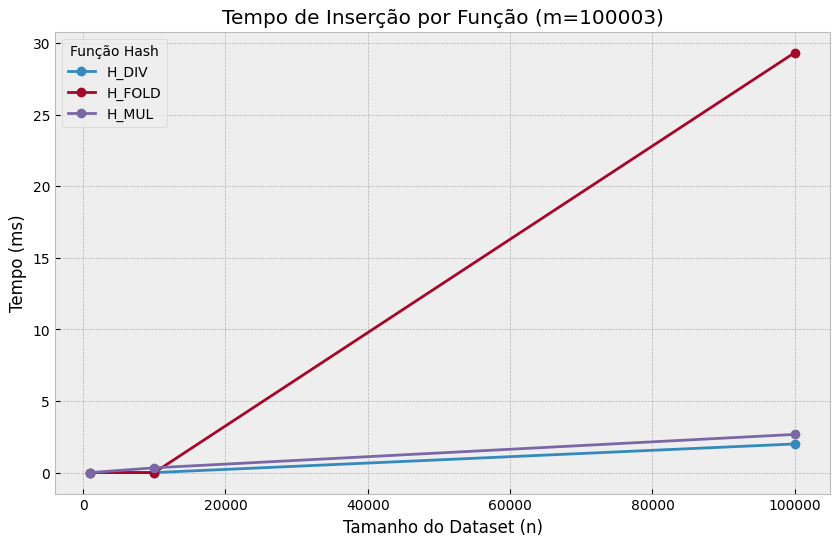
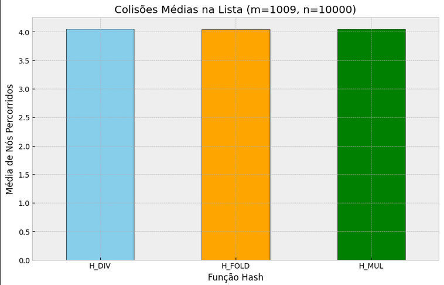
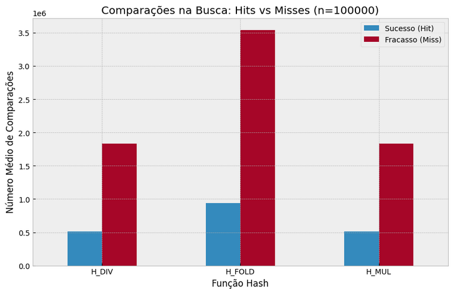

# Tabela Hash com Encadeamento Separado

## Instituição
- Nome da Instituição: PUCPR - Pontifícia Universidade Católica do Paraná
- Disciplina: Resolução de Problemas Estruturados em Computação
- Professor: Andrey Cabral Meira

## Vídeo de Apresentação: []

## Objetivo do Trabalho

Este projeto, desenvolvido em Java, implementa e analisa o desempenho de uma Tabela Hash com Encadeamento Separado (Separate Chaining). O objetivo é comparar a eficiência de diferentes funções de hashing e o impacto do fator de carga nas operações de inserção e busca.

## Estrutura do Projeto
- `No.java` → Representa a estrutura básica de um nó para a lista encadeada simples, contendo apenas a chave inteira e a referência para o próximo elemento.
- `TabelaHash.java` → Implementa as três funções de hash manuais (Divisão, Multiplicação e Dobramento) e contém a lógica de inserção e busca com coleta de métricas e cálculo de checksum.
- `Principal.java` → Gerencia os loops de configuração (tamanhos, seeds, funções), gera a saída formatada em CSV junto com os logs de auditoria.

## A análise foca em três métricas principais:
1. Tempo de Execução: Custo temporal para inserir e buscar elementos.
2. Colisões: Quantidade de conflitos na tabela e o comprimento das listas encadeadas.
3. Comparações: O número de verificações necessárias para localizar (ou não) uma chave.

## Implementação e Funções Hash

O projeto utiliza uma estrutura manual de vetor de nós (No[]) onde cada compartimento aponta para uma lista encadeada simples. Foram implementadas e comparadas as seguintes funções de mapeamento:

Funções em Análise:

1. H_DIV (Divisão): Calcula o resto da divisão da chave pelo tamanho da tabela ($h(k) = k \pmod m$). É eficiente, mas sensível a padrões nos dados se $m$ não for primo.
2. H_MUL (Multiplicação): Utiliza a constante áurea ($A \approx 0.618$) para dispersar as chaves, extraindo a parte fracionária do produto.
3. H_FOLD (Dobramento): Divide a chave em blocos de 3 dígitos e os soma. Útil para chaves longas onde todos os dígitos devem influenciar o hash.

## Regras e Restrições do Projeto

Este código foi desenvolvido sob regras estritas ("Java Básico") para focar na implementação pura da estrutura de dados, sem auxílio de bibliotecas prontas.

1. Proibido o uso de Coleções: Nenhuma classe como HashMap, ArrayList, Vector ou LinkedList foi utilizada. A lista encadeada foi implementada manualmente via classe No.
2. Proibido o uso de Math e Utilitários: Operações como valor absoluto e arredondamento foram feitas com operadores relacionais e casts.
3. Auditoria e Reprodutibilidade: O projeto utiliza sementes (seeds) fixas (137, 271828, 314159) para garantir que os números aleatórios sejam idênticos em todas as execuções.
4. Auditoria em Tempo Real: Antes de cada inserção, o sistema imprime um log de auditoria no canal de erro (stderr).

## Como Executar:
   
1. Abrir o Apache NetBeans
2. Criar um novo projeto usando Java Ant
3. Selecionar Java Application
4. Nomear o projeto como `hash_rec3`
5. Crie uma nova java class com o nome de `No.java` e copie o conteúdo de `No.java` para dentro do projeto.
6. Crie uma nova java class com o nome de `TabelaHash.java` e copie o conteúdo de `TabelaHash.java` para dentro do projeto.
7. Crie uma nova java class com o nome de `Principal.java` e copie o conteúdo de `Principal.java` para dentro do projeto.
8. Clique com o botão direito do mouse dentro do `Principal.java`.
9. Clique em Run File
10. A saída no console conterá os dados em formato CSV para análise.

## Análise de Desempenho

A análise foi conduzida variando o tamanho da tabela ($m \in \{1009, 10007, 100003\}$) e o tamanho do dataset ($n \in \{1000, 10000, 100000\}$).

## Metodologia

Conforme exigido na metodologia do experimento: "Distribuições mais uniformes reduzem o custo médio no encadeamento separado."

1. Tempo de Inserção
O gráfico abaixo demonstra o comportamento linear do tempo de inserção em relação ao tamanho do dataset.

3. Colisões (Qualidade do Hash)
Comparação da média de nós percorridos na lista durante a inserção. Funções que distribuem melhor geram listas menores (barras menores).

5. Busca (Hits vs. Misses)
Diferença de custo entre encontrar uma chave existente (Hit) e confirmar que ela não existe (Miss).

Os gráficos acima foram gerados a partir dos dados do CSV utilizando **Python** (bibliotecas `pandas` e `matplotlib`) executado no ambiente **Google Colab**.
[Clique aqui para acessar o Notebook (Código dos Gráficos)](https://colab.research.google.com/drive/18SnBURIvDnG4smHf0xghWLk7en1zQzxA?usp=sharing)

## Conclusão

A análise dos resultados experimentais permite tirar as seguintes conclusões:

1. Eficiência Temporal: O tempo de inserção cresceu linearmente com $n$, confirmando a complexidade média $O(1)$ (amortizada) da tabela hash bem dimensionada.
2. Impacto do Fator de Carga: Quando $n \gg m$ (tabela cheia), o número de colisões aumentou drasticamente, degradando o desempenho da busca para $O(n/m)$.
3. Custo da Falha: A busca malsucedida (Miss) mostrou-se consistentemente mais custosa que a busca bem-sucedida (Hit). Isso ocorre porque, para garantir que um item não existe, o algoritmo precisa percorrer a lista encadeada inteira do compartimento, enquanto no sucesso a busca encerra assim que o item é encontrado.

